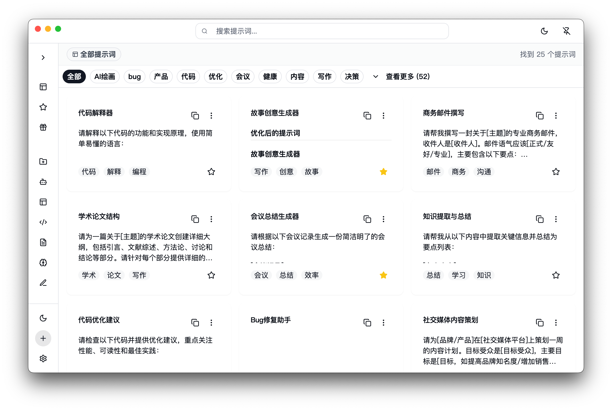

# PromptMate

  
  

    <strong>您的智能 AI 提示词管家</strong>
  

  

    一款简洁、高效的桌面端生产力工具，旨在帮助您系统化管理、高效使用和优化您的 AI 提示词（Prompts）。
  

  

    
    
    
    
  

---

## 🚀 它是什么？

在与 ChatGPT、Midjourney 等大模型频繁交互的过程中，您是否也曾为管理那些零散而宝贵的 Prompt 而烦恼？

**PromptMate** 是一款专为此场景设计的桌面效率工具。它能帮助您告别混乱的文本文件和笔记，将所有提示词集中管理、快速检索并一键调用，极大地提升您的 AI 交互效率。

## ✨ 特色功能

- **🗂️ 多层级分类管理**:
  - **文件夹层级**：通过创建不同的文件夹来归纳和整理不同场景的提示词。
  - **标签层级**：为每个提示词打上自定义标签，实现更灵活的交叉分类和筛选。

- **📇 卡片式视觉管理**:
  - 以直观的卡片形式展示您的每一个提示词，信息结构一目了然。

- **📝 变量化与表单编辑**:
  - 自动识别提示词中的 `{{变量}}`，并生成简洁的表单。
  - 您只需在表单中填写变量内容，即可快速生成最终版本，一键复制使用。

- **🤖 AI 智能优化**:
  - 支持接入通用大模型（LLM）的 API。
  - 选中您的提示词，即可一键调用 AI 对其进行优化、补充或翻译，激发更多灵感。

- **🎨 高度个性化**:
  - **自定义图标**: 为您的每个文件夹选择独特的图标，便于快速识别。
  - **自定义主题**: 内置多种主题，或自定义您的专属软件界面风格。

- **✍️ 支持 Markdown 语法**:
  - 在提示词内容中轻松使用 Markdown 格式，如加粗、列表、代码块等，排版更清晰。

- **📌 窗口置顶**:
  - 需要频繁参考？将 PromptMate 窗口置顶显示，始终保持在其它应用之上，方便随时查看和复制。

- **💾 本地化数据存储**:
  - 所有数据均存储在本地，确保您的提示词库私密、安全，并能离线访问。

- **🔍 快捷搜索**:
  - 内置强大的全文搜索引擎，输入关键词即可毫秒级定位到您需要的提示词。

## 🛠️ 优化与开发计划

我们正在积极地让 PromptMate 变得更强大！

### 正在优化中的功能

- **🌐 浏览器插件**:
  - 开发配套的浏览器插件，支持在网页端直接使用表单编辑变量，并一键将内容注入到对话框中。

### 后续开发计划

- **🔄 版本管理功能**:
  - 为您的重要提示词提供历史版本追溯与管理功能。

- **🆚 多模型对比**:
  - 集成多个大模型 API，方便您用同一个 Prompt 测试不同模型的输出效果。

- **流程化管理**:
  - 引入工作流（Workflow）模式，将多个提示词串联成一个任务流，实现更复杂的自动化操作。

- **⌨️ 全局快捷键**:
  - 支持自定义全局快捷键，随时随地一键呼出 PromptMate 主窗口。

## 📥 下载与安装

您可以前往我们的 **[Releases 页面](https://github.com/yy0691/PromptMate/releases)** 下载适用于您操作系统的最新版本。

目前支持 Windows 和 macOS。

## 快速开始

1.  下载并安装应用程序。
2.  创建您的第一个分类文件夹。
3.  点击 "新建"，开始编写您的第一个提示词。尝试使用 `{{示例变量}}` 来创建一个变量。
4.  保存后，在主界面点击该卡片，即可在右侧的表单中填充变量并复制结果！

## 🤝 贡献

我们欢迎任何形式的贡献！如果您有好的想法或发现了 Bug，请随时提交 [Issue](https://github.com/yy0691/PromptMate/issues) 或发起 [Pull Request](https://github.com/yy0691/PromptMate/pulls)。

## 📄 许可证

本项目基于 [MIT License](https://github.com/yy0691/PromptMate/blob/main/LICENSE) 开源。

